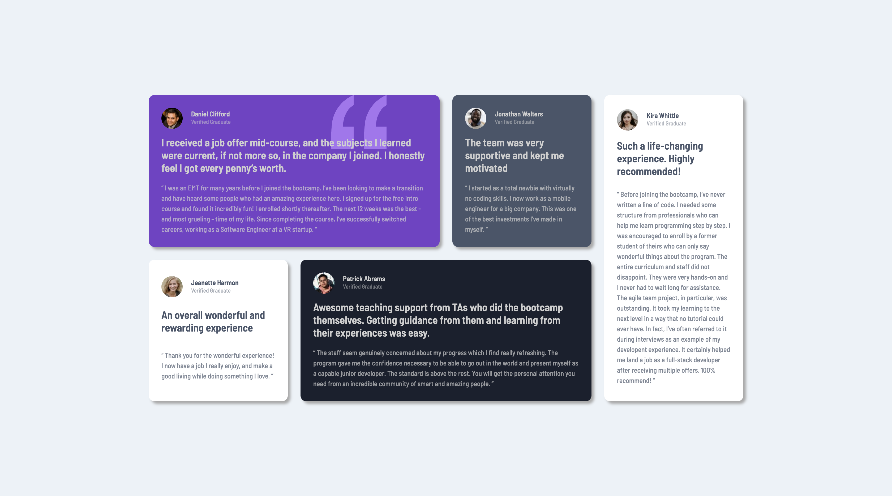

# Frontend Mentor - Testimonials grid section solution

This is a solution to the [Testimonials grid section challenge on Frontend Mentor](https://www.frontendmentor.io/challenges/testimonials-grid-section-Nnw6J7Un7).

## Table of contents

- [Overview](#overview)
  - [The challenge](#the-challenge)
  - [Screenshot](#screenshot)
  - [Links](#links)
- [My process](#my-process)
  - [What I learned](#what-i-learned)
  - [Useful resources](#useful-resources)
- [Author](#author)
- [Acknowledgments](#acknowledgments)

## Overview

### The challenge

Users should be able to:

- View the optimal layout for the site depending on their device's screen size

### Screenshot



### Links

- Live Site URL: <a href="https://frontend-mentor-grid-section-b8540.web.app/" target="_blank">Click Here</a>

## My process

### What I learned

While working on this challenge I learned how to use grid-template-areas to style and position my cards easier. I also learned how to style the quotation svg, on one of the cards as background image.

```css
grid-template-areas:
	'one'
	'two'
	'three'
	'four'
	'five';

.card:nth-child(1) {
	grid-area: one;
}

.card:nth-child(2) {
	grid-area: two;
}

.card:nth-child(3) {
	grid-area: three;
}

.card:nth-child(4) {
	grid-area: four;
}
.card:nth-child(5) {
	grid-area: five;
}

.main-container {
	grid-template-areas:
		'one one two five'
		'three four four five';
}

.card.quote {
	background-image: url(/images/bg-pattern-quotation.svg);
	background-repeat: no-repeat;
	background-position: top right 22.5%;
}
```

### Useful resources

- <a href="https://css-tricks.com/snippets/css/complete-guide-grid/" target="_blank">Grid</a> - This helped me understand and how to use grid.
- <a href="https://developer.mozilla.org/en-US/docs/Web/CSS/background-image" target="_blank"> Background Image</a>- Helped me understand how to style the quotation svg on one the cards

## Author

- Linkedin - [Jaweed Inayathulla](https://www.linkedin.com/in/jaweedinayathulla/)
- Frontend Mentor - [@InaJaweed](https://www.frontendmentor.io/profile/InaJaweed)

## Acknowledgments

I want to acknowledge a helpful YouTube video that significantly contributed to my understanding of CSS concepts for grid The video can be found at: https://www.youtube.com/watch?v=duH4DLq5yoo&list=LL&index=1
